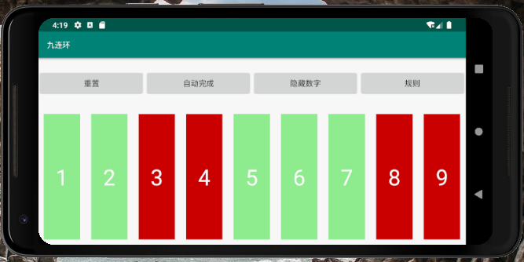

# PuzzleRing
PuzzleRing/九连环  


## 介绍
```
九连环的每个环互相制约，只有第一环能够自由上下。要想下/上第n个环，就必须满足两个条件(第一个环除外)。一、第n-1个环在架上；二、第n-1个环前面的环全部不在架上。玩九连环就是要努力满足上面的两个条件。解下九连环本质上要从后面的环开始下，而先下前面的环，是为了下后面的环，前面的环还要装上，不算是真正地取下来。

-------摘自百度百科
```

实现效果:  
  

按图介绍，红色表示环在架上，绿色表示环被取下。  
Reset将所有环状态置为红色  
Auto可自动解出任意状态的九连环，并以慢速演示过程  
ShowNum显示每个环的数字，较鸡肋  


## Bug
为了能看清楚，使用了延时，但不能在主线程延时，故使用了AsyncTask。  

在点击"Auto"按钮之后，若在求解完成之前点击"Reset"，结果会出错  
对android只是了解一点，欢迎大家交流，帮忙解bug，^_^
  